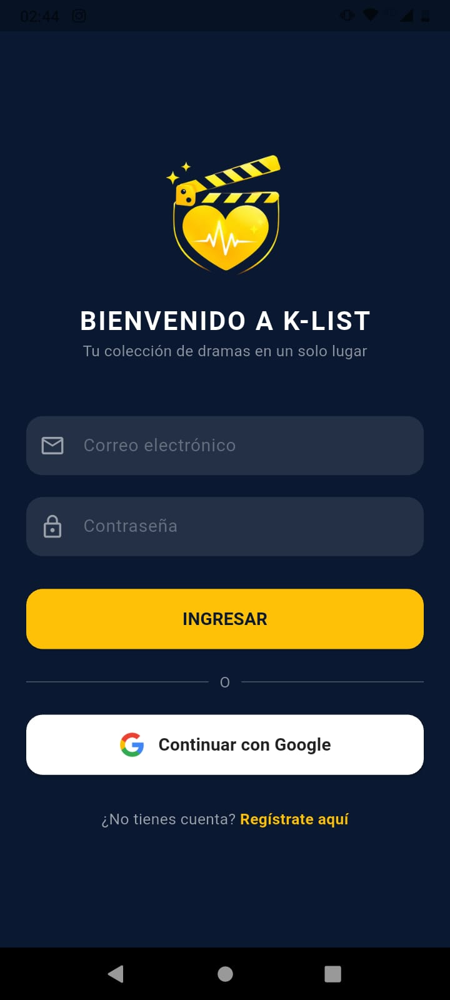
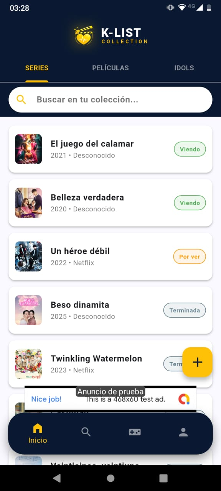
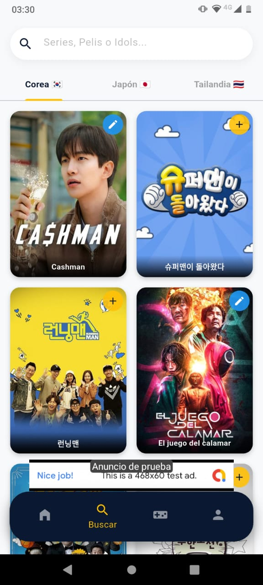
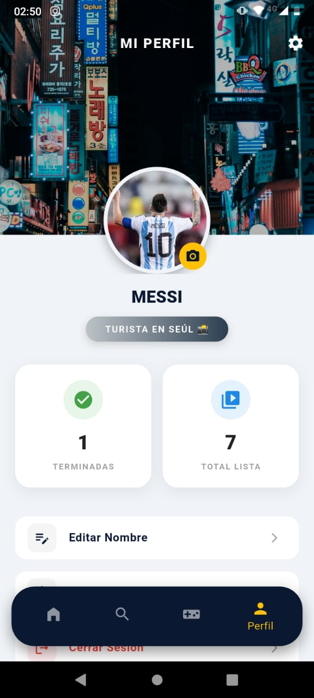

# 🎬 K-List Collection

**K-List** es una aplicación móvil Full Stack diseñada para los amantes del contenido asiático (K-Dramas, Películas y Idols). Permite a los usuarios descubrir, gestionar y calificar su historial de visualización con una experiencia de usuario gamificada y moderna.

Este proyecto simula un entorno de producción real, implementando una **Clean Architecture** en el cliente y un **Backend propio** para la lógica de negocio.

---

## 📱 Capturas de Pantalla

| Login | Inicio | Buscador | Detalle | Perfil |
|:---:|:---:|:---:|:---:|:---:|
| |  |  |  |  |

---

## 🛠️ Stack Tecnológico

### 📱 Cliente (Mobile)
* **Framework:** Flutter (Dart).
* **Arquitectura:** Clean Architecture (Separación de UI, Dominio y Datos).
* **Estado:** `setState` optimizado y gestión de memoria eficiente.
* **Dependencias Clave:**
    * `http`: Comunicación con API REST.
    * `firebase_auth` & `google_sign_in`: Autenticación segura.
    * `google_mobile_ads`: Monetización (AdMob).
    * `shared_preferences` & `flutter_secure_storage`: Persistencia local.

### 🔙 Backend & Infraestructura
* **Lenguaje:** Python 3.10+.
* **Framework:** FastAPI (Alto rendimiento y validación de tipos).
* **Base de Datos:** PostgreSQL (Alojada en **Neon Tech** Serverless).
* **Despliegue:** Render (Web Service con monitoreo activo).
* **Seguridad:** Validación de Tokens JWT (Google) y hashing de contraseñas.

---

## ✨ Funcionalidades Clave

1.  **Autenticación Híbrida:**
    * Inicio de sesión social con **Google** (sincronizado entre Firebase y Backend Python).
    * Registro tradicional por correo/contraseña.
2.  **Gestión de Colección (CRUD):**
    * Agregar series/películas con estados: *Viendo, Por ver, Terminada, Abandonada*.
    * Sistema de ordenamiento inteligente (Prioriza contenido "Viendo").
3.  **Integración con TMDB API:**
    * Buscador en tiempo real con *Debounce* para optimizar peticiones.
    * Acceso a posters, sinopsis y datos de actores.
4.  **Sistema de Gamificación:**
    * Rangos de usuario basados en series terminadas (Ej: *Turista en Seúl* ➝ *Secretario Kim*).
    * Estadísticas en tiempo real en el perfil.
5.  **Monetización & UX:**
    * Integración de Banners Publicitarios (AdMob) no intrusivos.
    * Modo Offline para consulta de datos guardados.

---

## 🚀 Instalación y Despliegue

Este proyecto requiere tanto el cliente Flutter como el servidor Python.

### 1. Clonar Repositorio

```bash
git clone [https://github.com/nicodavila18/k-list-app.git](https://github.com/nicodavila18/k-list-app.git)
```

### 2. Configuración (Variables de Entorno)

Crea un archivo `.env` en la raíz del proyecto Flutter:

```env
API_URL=[https://tu-backend-python.onrender.com](https://tu-backend-python.onrender.com)
TMDB_KEY=tu_api_key_de_tmdb
GOOGLE_CLIENT_ID=tu_cliente_id_google
```

### 3. Ejecutar App

```bash
flutter pub get
flutter run
```

---

## 👤 Autor

**Nicolás Dávila**

Desarrollador Full Stack (Flutter & Python).

[LinkedIn](https://www.linkedin.com/in/nicodavila18/)